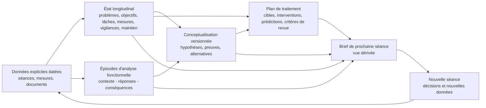

# Architecture documentaire clinique

**Phase :** conception clinique, avant schémas JSON et avant RAG  
**Date de l'analyse :** 17 août 2026  
**Destinataire principal :** psychologue-psychothérapeute  
**Périmètre :** données issues des séances, état longitudinal, analyse fonctionnelle, conceptualisation, plan de traitement et préparation de prochaine séance

## 1. Conclusion directrice

**[SYNTHÈSE]** Le corpus converge vers une architecture où la conceptualisation est un **modèle de travail révisable**, relié à des données observables, des objectifs, un plan et des mesures. Persons décrit la boucle clinique complète ; Kuyken, Padesky et Dudley ajoutent une discipline de profondeur graduée et de collaboration ; Eells distingue explicitement observation, inférence et pluralité théorique.

**[PROPOSITION POUR NOTRE SYSTÈME]** La préparation de séance doit être une **vue opérationnelle dérivée**, courte et datée. Elle ne doit être la source de vérité d'aucun objectif, mécanisme, score, devoir, point à reprendre ou élément de vigilance.

Le flux recommandé est :

Cette figure décrit des **objets logiques**, pas nécessairement des bases de données distinctes.

## 2. Ce que les sources soutiennent

### SOURCE

- Persons organise le traitement comme une boucle d'évaluation, formulation, planification, intervention et suivi ; la formulation initiale est une hypothèse incomplète, constamment testée et révisée (*The Case Formulation Approach to Cognitive-Behavior Therapy*, chap. 1, pp. 1-6 ; PDF pp. 16-21).
- Persons distingue la formulation du cas, d'un problème et d'un épisode particulier ; elle relie ensuite mécanisme, cible, intervention et mesure (chap. 1, p. 7 ; chap. 6-10, pp. 126-214 ; PDF pp. 22, 141-229).
- Kuyken, Padesky et Dudley distinguent trois niveaux : descriptif, explicatif transversal et explicatif longitudinal. Ils recommandent le niveau d'inférence le plus bas qui suffit aux objectifs ; le niveau longitudinal n'est pas toujours nécessaire (*Collaborative Case Conceptualization*, chap. 2, pp. 27-43 ; PDF pp. 46-62).
- Les mêmes auteurs demandent que le modèle soit modifié ou abandonné lorsque observations, expériences ou résultats le contredisent (chap. 2, pp. 29-31 ; PDF pp. 48-50).
- Eells définit la formulation comme une hypothèse organisée qui guide un plan, tout en rappelant que les mécanismes dépendent du cadre théorique et que toute inférence doit pouvoir être reliée à des phénomènes observés (*Handbook of Psychotherapy Case Formulation*, 3e éd., chap. 1, pp. 2-4 et 22-25 ; PDF pp. 15-17 et 35-38).
- Le chapitre comportemental d'Eells privilégie des relations fonctionnelles fiables, prédictives et modifiables, puis une évaluation itérative de l'effet du plan (chap. 11, pp. 323-339 ; PDF pp. 336-352).

### SYNTHÈSE

Le dénominateur commun robuste n'est pas un récit causal unique. C'est une chaîne traçable :

`données → problèmes → objectifs → épisodes → hypothèses → cibles → interventions → prédictions → mesures → révisions`.

### PROPOSITION POUR NOTRE SYSTÈME

Implémenter cette chaîne sous forme d'objets reliés, avec provenance et version. Une même information ne doit avoir qu'un lieu d'autorité ; les documents n'en présentent que des vues adaptées à leur fonction.

## 3. Les quatre couches à ne pas confondre

| Couche | Contenu | Cycle de vie | Règle principale |
|---|---|---|---|
| Connaissance théorique | modèles, mécanismes généraux, recommandations des ouvrages | versionnée avec la bibliothèque | ne décrit jamais automatiquement une personne suivie |
| Évidence clinique | propos, observations, scores, événements et décisions documentés | append-only, sauf correction tracée | chaque élément porte date et provenance |
| État longitudinal | problèmes, objectifs, tâches, mesures, vigilances, points à reprendre, plan de maintien/rechute | mis à jour avec historique | une source de vérité par objet |
| Modèle de travail et décision | hypothèses, formulation, plan, options de séance | révisable et versionné | ne jamais masquer l'incertitude ni la validation clinique |

Chaque assertion clinique conserve l'un des quatre statuts canoniques : `explicite`, `synthese_prudente`, `hypothese_clinique` ou `inconnu_a_explorer`. Ces statuts qualifient le rapport aux données ; ils restent distincts du statut d'une action ou d'une décision.

**Risque critique évité :** un principe général tel que « l'évitement peut maintenir l'anxiété » appartient à la connaissance théorique. Il ne devient une hypothèse individuelle qu'à partir de données du cas ; il ne devient pas un fait même s'il est répété dans plusieurs documents.

## 4. Objets logiques minimaux et sources de vérité

### 4.1 `evenement_clinique`

Unité d'évidence datée : déclaration, observation, résultat de mesure, document reçu, décision effectivement prise, essai d'intervention ou feedback/processus thérapeutique.

Contenu minimal :

- date de l'événement et date de consignation ;
- type de source ;
- contenu utile et suffisamment atomique ;
- séance ou document d'origine et localisation ;
- auteur de la consignation si pertinent ;
- négation, contradiction ou correction ultérieure.

Deux sous-types peuvent recevoir une structure plus riche sans devenir des sources de vérité indépendantes :

- **résultat de mesure** : point canonique contenant valeur, date, conditions, instrument/version et provenance ; une série ne fait que le référencer ;
- **essai d'intervention** : technique ou stratégie effectivement menée, cible, prédiction, paramètres, effet, tolérance et apprentissage ; il reste distinct de l'intervention seulement planifiée dans le plan de traitement ;
- **feedback/processus thérapeutique** : accord, compréhension, utilité perçue, difficulté ou rupture documentée et réponse apportée.

**Source de vérité :** notes, transcriptions, mesures et documents originaux, référencés sans recopier inutilement leur texte complet.

**Pourquoi :** une synthèse ou une hypothèse doit rester auditable. Une correction ne doit pas réécrire silencieusement l'historique.

### 4.2 `probleme_suivi`

Description neutre d'une difficulté ou d'un domaine de fonctionnement qui mérite un suivi.

Contenu minimal : description, impact, priorité, statut, chronologie et liens vers objectifs, mesures, épisodes et hypothèses. Un diagnostic peut être lié au problème mais ne le remplace pas.

**Source de vérité :** registre longitudinal des problèmes.

**SOURCE :** Persons recommande une liste complète puis hiérarchisée ; Kuyken et al. privilégient une description neutre, l'impact et les priorités (Persons, chap. 5, pp. 96-125 ; Kuyken et al., chap. 5, pp. 121-133).

### 4.3 `objectif_therapeutique`

Résultat ou changement de processus effectivement négocié.

Contenu minimal :

- formulation documentée ;
- problème lié ;
- type : résultat, processus ou compétence ;
- indicateur d'atteinte ;
- importance, priorité, horizon et statut ;
- progression et motifs de révision, sous forme d'événements liés.

**Source de vérité :** registre unique des objectifs. Le plan et le brief ne stockent qu'une référence et une représentation datée.

**SOURCE :** objectifs significatifs, réalistes, mesurables et priorisés chez Persons (chap. 6, pp. 143-146) ; observables, positifs et autant que possible sous le contrôle de la personne chez Kuyken et al. (chap. 5, pp. 152-157).

### 4.4 `serie_de_mesures`

Agrégat longitudinal de résultats de mesure comparables, quantitatifs ou idiographiques.

Contenu minimal au niveau de la série : instrument et version, construit, finalité, règles de comparabilité, motif de passation et échéance suivante. Les valeurs brutes, dates et conditions restent dans les événements `resultat_de_mesure` canoniques que la série référence ; elles ne sont pas recopiées. La tendance est une synthèse dérivée, séparée des valeurs brutes.

**Source de vérité :** registre des mesures.

**SOURCE :** Persons distingue résultats et processus et recommande un suivi régulier (chap. 9, pp. 182-198). Bouvard et Cottraux distinguent mesures normatives et ipsatives : une mesure intra-individuelle n'autorise pas nécessairement une comparaison à une norme de groupe (*Protocoles et échelles d'évaluation en psychiatrie et psychologie*, 5e éd., chap. 6, pp. 55-56, EPUB à pagination imprimée).

### 4.5 `tache_intersession`

Action effectivement convenue, et non simple option envisagée.

Contenu minimal : consigne, objectif ou mécanisme lié, date, échéance, conditions de réalisation, résultat documenté, apprentissages, effets indésirables, obstacles et décision de poursuivre, adapter ou arrêter.

**Source de vérité :** registre des tâches interséances.

**Règle :** si le résultat n'est pas documenté, conserver « résultat non documenté », jamais « non réalisée ».

### 4.6 `element_a_reprendre`

Sujet, question ou décision explicitement différé.

Contenu minimal : origine, raison du report, priorité ou échéance, statut de résolution.

**Source de vérité :** registre de continuité. La préparation de séance le récupère ; elle n'en est pas l'unique mémoire.

### 4.7 `vigilance_clinique`

Élément dont l'oubli pourrait modifier sécurité, tolérance ou pertinence du travail prévu.

Contenu minimal : nature, données fondatrices, date de dernière évaluation, `etat_de_vigilance` documenté, action/échéance/responsabilité lorsqu'elles existent. Chaque assertion conserve l'un des quatre statuts épistémiques ; si l'état actuel est indéterminé et que son actualisation est décisionnelle, elle porte `inconnu_a_explorer` plutôt qu'un pseudo-statut supplémentaire.

**Source de vérité :** registre partagé des vigilances, gouverné par les procédures professionnelles du projet.

**Limite :** le corpus TCC inspecté ne suffit pas à définir à lui seul un dispositif de gestion des risques. Le périmètre, les alertes et les responsabilités exigent un chantier de sécurité distinct. L'absence de mention ne prouve jamais une absence de risque.

### 4.8 `episode_fonctionnel`

Unité micro, proche des données :

- contexte et antécédents internes/externes ;
- réponses distinguées : comportement, cognition, émotion, sensation ;
- conséquences immédiates et différées ;
- évitements, comportements de sécurité et contingences, s'ils sont documentés ;
- fonction supposée, séparée des composants explicites ;
- données manquantes utiles et provenance de chaque composant.

**Source de vérité :** registre des épisodes fonctionnels.

**SOURCE :** Persons, chap. 3, pp. 42-64 ; Kuyken et al., chap. 5-6, pp. 139-144 et 181-189 ; Eells, chap. 11, pp. 323-339.

**Règle de parcimonie :** ne pas transformer chaque détail de séance en épisode. Retenir les épisodes représentatifs, décisionnels ou utiles pour tester une hypothèse.

### 4.9 `conceptualisation_versionnee`

Objet macro qui relie, sans les recopier :

- problèmes expliqués ;
- mécanismes de maintien prioritaires ;
- précipitants ;
- facteurs historiques seulement s'ils éclairent le présent ou le plan ;
- forces, exceptions et facteurs protecteurs contextualisés ;
- preuves pour, preuves contre, alternatives ;
- prédictions testables ;
- implications thérapeutiques ;
- date, version, auteur/validation et motif de révision.

**Source de vérité :** graphe ou document versionné de conceptualisation.

**PROPOSITION POUR NOTRE SYSTÈME :** le noyau obligatoire est descriptif et transversal. Les hypothèses d'origine ou de vulnérabilité distale sont des extensions facultatives, plus inférentielles, ajoutées seulement si elles modifient une compréhension ou une décision.

### 4.10 `plan_de_traitement`

Le plan relie explicitement :

`problème → objectif → mécanisme ou cible → intervention → prédiction → indicateur → critère de révision`.

Il conserve statut, séquence, justification individualisée, prérequis, préférences, vigilances, accord documenté, option de repli et condition de réexamen.

**Source de vérité :** plan actif avec historique des versions.

**SOURCE :** Persons, chap. 7, pp. 150-165 ; Beck, *Cognitive Behavior Therapy: Basics and Beyond*, 3e éd., chap. 9 « Treatment Planning » ; Eells, chap. 9 et 11.

**Règle :** la bibliothèque de techniques et les protocoles diagnostiques sont des connaissances externes. Ils ne deviennent des éléments du plan qu'après mise en relation avec les données, les objectifs et le jugement clinique.

### 4.11 `plan_maintien_rechute`

Objet longitudinal, commencé avant la fin du traitement et enrichi par les apprentissages réellement observés.

Contenu minimal :

- acquis, compétences et réponses utiles documentés ;
- habitudes ou contextes protecteurs ;
- signes précoces individualisés, avec contexte, intensité et durée ;
- fluctuations attendues, sans les assimiler automatiquement à une rechute ;
- actions graduées, soutiens et conditions de réévaluation ou de reprise de contact ;
- modalité de suivi, version et date de revue.

**Source de vérité :** plan longitudinal de maintien. Il peut être relié au plan de traitement, mais n'est pas reconstruit à chaque note ni réduit à un paragraphe de terminaison.

**SOURCE :** Beck, chap. 21 ; Bouvet, chap. 7, pp. 294-302 ; *Unified Protocol*, chap. 14, pp. 163-169 / PDF pp. 176-182.

### 4.12 `brief_preparation_seance`

Vue dérivée des objets précédents. Elle présente uniquement ce qui peut influencer la prochaine séance : fraîcheur, vigilances, changements, continuité, objectifs, tâches, mesures, mécanismes ou hypothèses prioritaires, questions, agenda proposé et options conditionnelles.

**Source de vérité :** aucune. Le brief peut être conservé comme instantané d'audit, mais toute mise à jour se fait dans l'objet longitudinal concerné.

## 5. Répartition par document

| Information | Longitudinal | Analyse fonctionnelle | Conceptualisation | Plan de traitement | Préparation de séance |
|---|---:|---:|---:|---:|---:|
| événements explicites | source | référence ciblée | référence | référence | sélection récente |
| problèmes et impacts | source | lien | sélection expliquée | lien | problèmes prioritaires |
| objectifs actifs | source | lien éventuel | lien | source du ciblage | vue synthétique |
| mesures brutes | événements `resultat_de_mesure` canoniques, indexés par la série | lien | preuves liées | indicateurs | tendance/mesure due |
| tâches interséances | source | données possibles | lien si informatif | mise en œuvre | tâches à revoir |
| épisodes contexte-réponse-conséquences | lien | source | preuves | lien | épisodes récents utiles |
| mécanismes de maintien | historique d'hypothèses | hypothèse locale | source versionnée | cible | au plus quelques priorités |
| facteurs historiques | faits datés | rarement | seulement si utiles | adaptation éventuelle | uniquement si décisionnels |
| forces/protections | source contextualisée | cycles adaptatifs | intégration fonctionnelle | mobilisation | ressources utiles maintenant |
| intervention planifiée ou active | historique de décisions | non | implication | source dans le plan | option ou travail à suivre |
| intervention réellement menée et effets | événement `essai_intervention` canonique | test possible | preuve liée | référence et comparaison à la prédiction | continuité ou apprentissage utile |
| vigilance | source | contexte possible | lien prudent | prérequis/limite | affichage prioritaire |
| plan de maintien/rechute | source longitudinale | liens vers épisodes utiles | liens vers mécanismes et ressources | module actif ou de consolidation | rappel seulement si décisionnel |
| agenda proposé | non | non | non | non | dérivé uniquement |

## 6. Cycle de vie des hypothèses

### SOURCE

Persons décrit la formulation comme hypothèse continuellement testée ; Kuyken et al. demandent de simplifier, modifier ou abandonner un modèle contredit ; Eells rappelle que le cadre théorique influence le mécanisme inféré.

### PROPOSITION POUR NOTRE SYSTÈME

Une hypothèse possède au minimum :

- statut épistémique `hypothese_clinique` ;
- éléments pour et contre ;
- alternatives ;
- niveau de confiance qualitatif si retenu ;
- question ou prédiction testable ;
- état de cycle de vie : `brouillon`, `partagee`, `active`, `affaiblie`, `abandonnee` ou `remplacee` ;
- date et motif de toute transition.

Une hypothèse « soutenue » n'est jamais automatiquement convertie en fait. Une hypothèse abandonnée disparaît des vues courantes mais reste dans l'historique.

## 7. Niveau d'inférence

Pour rendre visible la distance aux données, associer à chaque énoncé explicatif un niveau distinct du statut épistémique :

| Niveau | Nature | Exemple abstrait |
|---:|---|---|
| 0 | donnée explicite | comportement rapporté dans une situation datée |
| 1 | description structurée | régularité résumée sur plusieurs événements |
| 2 | relation fonctionnelle à tester | conséquence immédiate susceptible d'augmenter un comportement |
| 3 | mécanisme théorique | croyance, apprentissage ou processus émotionnel supposé |
| 4 | origine longitudinale | hypothèse développementale ou distale |

Ce niveau ne remplace pas les quatre statuts épistémiques. Il complète surtout `hypothese_clinique` afin de distinguer une relation proche des données d'une explication historique éloignée.

## 8. Mise à jour après chaque séance

1. Enregistrer les nouvelles données et leur provenance.
2. Extraire les éléments explicites en conservant date, négation et contradictions.
3. Mettre à jour uniquement les registres concernés ; ne pas réécrire toute la synthèse.
4. Réexaminer les hypothèses touchées par les nouvelles données.
5. Mettre à jour objectifs, plan, tâches ou vigilances seulement lorsqu'une décision ou une information le justifie.
6. Conserver les versions et motifs de changement.
7. Générer le brief suivant à partir de l'état validé.
8. Exiger une validation clinique avant promotion d'un texte généré dans le dossier patient.

## 9. Risques de duplication et règles correctrices

| Risque | Exemple | Règle correctrice |
|---|---|---|
| objectifs divergents | objectif modifié dans le plan mais ancien dans le brief | registre unique ; toutes les vues affichent version/date |
| tâche perdue | devoir uniquement écrit dans la note de séance | objet tâche lié à la note et à l'objectif |
| hypothèse réifiée | même mécanisme répété sans preuves dans plusieurs documents | une hypothèse versionnée ; références, jamais copies autonomes |
| score interprété différemment | plusieurs résumés recalculent la tendance | scores bruts uniques ; synthèse de tendance datée |
| plan sans cible | technique ajoutée depuis une bibliothèque | lien obligatoire vers objectif et cible individualisée |
| point à reprendre oublié | conservé seulement dans un ancien brief | registre de continuité avec statut |
| fausse actualité | brief fondé sur une transcription incomplète | date de coupure et qualité des sources toujours visibles |
| double conceptualisation ACT | formulation TCC et formulation ACT parallèles | même graphe de mécanismes ; extension ACT seulement si utile |
| absence de risque déduite | aucune mention récente | afficher l'ancienneté ou l'inconnu, jamais une absence affirmée |

## 10. Place du diagnostic et des protocoles

**[SOURCE]** Persons et le chapitre CBT d'Eells recommandent de partir, lorsque pertinent, d'un modèle nomothétique ou d'un traitement soutenu, puis de l'individualiser. Kuyken et al. rappellent qu'un protocole validé peut suffire pour une présentation simple et bien ajustée.

**[SYNTHÈSE]** L'individualisation n'est pas automatiquement supérieure à un protocole efficace ; les preuves propres à la formulation restent hétérogènes.

**[PROPOSITION POUR NOTRE SYSTÈME]** Le diagnostic peut :

- indexer des modèles, mesures et interventions possibles ;
- informer les vigilances et les différentiels ;
- fournir une référence nomothétique.

Il ne doit pas :

- créer automatiquement un mécanisme individuel ;
- sélectionner seul le plan ;
- imposer un objectif ;
- transformer un protocole en décision.

## 11. Place conditionnelle de l'ACT

Les processus ACT restent dans la couche de connaissance théorique et peuvent être reliés au même graphe clinique uniquement si :

1. des données individuelles rendent un processus pertinent ;
2. ce processus améliore réellement la compréhension ou ouvre une intervention différente ;
3. il est lié à un objectif actif ;
4. il n'est pas déjà représenté de façon suffisante par l'analyse comportementale ou cognitive.

Il n'existe donc ni champ ACT obligatoire, ni conceptualisation ACT parallèle par défaut.

## 12. Frontière entre document interne et dossier patient

La structure peut contenir des hypothèses de travail plus détaillées qu'un document destiné à la personne ou à un tiers. Cependant :

- tout énoncé conserve son statut et sa provenance ;
- la formulation professionnelle et une éventuelle vue partagée sont deux vues d'un même graphe, pas deux vérités divergentes ;
- les données identifiantes sont minimisées et séparées du contenu clinique lorsque possible ;
- un contenu généré ne devient conservable dans le dossier qu'après validation explicite ;
- l'historique des validations et corrections est conservé.

## 13. Critères d'acceptation avant implémentation

L'architecture est prête à être traduite en schémas seulement si les tests suivants sont satisfaits :

- chaque information importante a une source de vérité unique ;
- une assertion peut être retracée jusqu'à une donnée ou identifiée comme hypothèse/proposition ;
- une donnée manquante reste manquante ;
- une hypothèse peut être affaiblie, abandonnée ou remplacée sans effacer son histoire ;
- un objectif modifié se répercute dans toutes les vues ;
- le brief peut être régénéré sans perte d'information ;
- aucun protocole ni concept ACT n'est injecté automatiquement par diagnostic ;
- une contradiction peut être conservée sans forcer une résolution ;
- les propositions de l'IA sont séparées des décisions du clinicien et des décisions conjointes ;
- la vue courante reste courte même lorsque l'historique devient riche.
