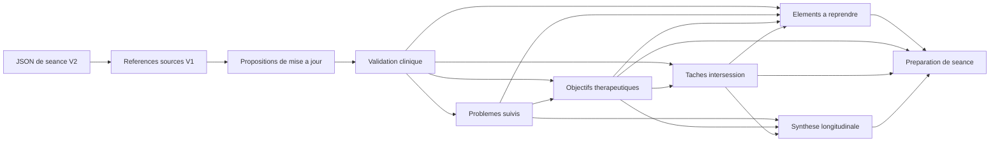

# Proposition de conception - modele clinique longitudinal V1

**Statut :** document de travail soumis a arbitrage  
**Date :** 20 aout 2026  
**Perimetre :** couche clinique situee entre les JSON de seance V2 / la synthese longitudinale et les futurs documents avances  
**Hors perimetre :** implementation Python, schema JSON definitif, modification des donnees fictives

## 1. Decision directrice

Le pipeline actuel dispose de bonnes **sources de seance** et de bonnes **vues derivees**, mais il ne dispose pas encore d'un registre durable pour les objets dont l'identite et l'etat doivent survivre a plusieurs seances.

La V1 doit introduire quatre objets longitudinaux d'autorite :

1. `probleme_suivi` ;
2. `objectif_therapeutique` ;
3. `tache_intersession` ;
4. `element_a_reprendre`.

Ces quatre objets sont justifies, mais ils ne doivent pas etre crees ou modifies directement par un texte genere. La V1 doit donc egalement distinguer :

- le **registre longitudinal valide**, source de verite de l'identite et de l'etat courant des objets ;
- les **propositions de mise a jour**, generees et tracables, qui restent des brouillons jusqu'a validation ;
- les **references de provenance V1**, qui relient une assertion a un fichier JSON, une date et un element source sans pretendre disposer d'un alignement avec une zone manuscrite.

La synthese longitudinale et la preparation de prochaine seance restent fonctionnelles. Elles deviennent progressivement des vues qui referencent ce registre, sans etre reecrites en une seule etape.

## A. Diagnostic de l'architecture actuelle

### A.1 Forces a conserver

Le code actuel fournit deja plusieurs garanties importantes :

- schemas Pydantic stricts et versions explicites ;
- distinction entre JSON clinique de seance, synthese longitudinale et preparation ;
- controles deterministes des dates sources ;
- empreintes SHA-256, anti-doublon et regeneration conditionnelle ;
- conservation des jetons meme lorsqu'un controle deterministe rejette une sortie ;
- traitement par patient et mise a jour en fin de lot ;
- separation dans la preparation entre `donnees_documentees`, `syntheses_prudentes` et `suggestions_ia` ;
- copie deterministe des taches et incertitudes de la derniere seance ;
- possibilite de laisser des listes vides.

Ces mecanismes sont une base adaptee pour ajouter un registre longitudinal sans casser le pipeline.

### A.2 Limites structurelles actuelles

#### JSON de seance V2

Les JSON V2 sont des extractions datees utiles, mais leurs elements :

- n'ont pas d'identifiant stable ;
- sont localises seulement par fichier, categorie et position dans une liste ;
- ne distinguent pas toujours proposition, accord, realisation et resultat ;
- ne representent pas explicitement les objectifs therapeutiques ;
- ne representent pas explicitement les sujets deliberement reportes ;
- ne conservent pas un historique de correction ou de contradiction au niveau de l'element.

Ils doivent rester des sources de seance. Ils ne peuvent pas, seuls, devenir le registre de l'etat longitudinal.

#### Synthese longitudinale V1.1

La synthese actuelle compresse utilement plusieurs seances et conserve des dates sources. Cependant :

- elle est regeneree comme un document complet ;
- ses elements n'ont pas d'identifiants stables ;
- elle ne conserve pas l'historique d'un probleme ou d'une tache ;
- `taches_actuelles` et `points_a_reprendre` sont recalcules par le modele ;
- une date de source ne localise pas l'element JSON exact ;
- elle ne distingue pas un objet valide d'un candidat genere.

Elle doit continuer a fournir une vue clinique narrative et prudente. A terme, les problemes, taches et points durables qu'elle affiche devront etre projetes depuis leurs registres d'autorite.

#### Preparation de prochaine seance V1.0

La preparation est deja une vue derivee et son architecture epistemique est saine. Elle reste toutefois transitoire sur deux points :

- les taches sont recopiees depuis la derniere seance plutot que referencees depuis un cycle de vie longitudinal ;
- certains points ou suggestions sont reconstruits a chaque generation faute de registre durable.

La preparation ne doit jamais devenir le lieu de creation ou de modification d'un objet longitudinal. Une suggestion du brief reste `proposition_systeme`.

### A.3 Couche manquante

La couche manquante est un **registre clinique longitudinal valide et versionne**, accompagne d'un flux de propositions de mise a jour. Il doit repondre a quatre questions que les vues actuelles ne peuvent pas resoudre durablement :

1. S'agit-il du meme objet clinique qu'a la seance precedente ?
2. Quel est son etat courant, et sur quelle decision repose cet etat ?
3. Comment et pourquoi cet etat a-t-il change ?
4. Quelles vues peuvent le lire sans en creer une copie divergente ?

## B. Objets longitudinaux proposes pour la V1

### B.1 `probleme_suivi`

#### Justification clinique

La liste de problemes est explicitement justifiee par la cartographie clinique : description neutre, impact, priorite et chronologie doivent preceder l'explication. Un diagnostic peut informer un probleme, mais ne le remplace pas. La preparation, les objectifs, les mesures et la future conceptualisation ont tous besoin d'une identite stable du probleme.

References internes : `01_cartographie_clinique.md`, sections 4, 6, 16 et 17.1 ; `02_architecture_documentaire.md`, section 4.2.

#### Contenu V1 minimal

- identifiant stable ;
- libelle descriptif courant ;
- description et contexte utiles ;
- impact documente, s'il existe ;
- priorite documentee, sinon absente ;
- etat du cycle de vie ;
- statut epistemique de chaque assertion ;
- liens vers objectifs, taches et sources ;
- version courante et historique des revisions.

#### Source de verite

Le registre longitudinal des problemes est l'autorite pour l'identite, le libelle courant, l'etat et les relations. Les JSON de seance restent l'autorite probatoire des faits qui soutiennent le probleme.

#### Creation et mise a jour

- Le systeme peut proposer un candidat a partir de faits, emotions, cognitions, comportements ou evitements explicites.
- Le regroupement de plusieurs donnees en un probleme est au minimum `synthese_prudente` et reste une proposition avant validation.
- L'activation, la priorisation, la mise en pause, la resolution, l'abandon, la reactivation, la fusion ou le remplacement exigent une decision documentee.
- La non-mention ulterieure ne modifie jamais l'etat.

### B.2 `objectif_therapeutique`

#### Justification clinique

Un objectif possede un cycle de vie propre et doit etre partage par la conceptualisation, le plan, la preparation et les mesures. Les sources distinguent resultat de vie ou de fonctionnement, objectif de processus, etape d'action et indicateur. Une tache n'est pas un objectif.

References internes : `01_cartographie_clinique.md`, section 8 ; `02_architecture_documentaire.md`, section 4.3 ; `05_preparation_prochaine_seance.md`, champ 5.

#### Contenu V1 minimal

- identifiant stable ;
- formulation documentee ;
- type : `resultat`, `processus` ou `competence` ;
- probleme(s) lie(s) ;
- indicateur d'atteinte, s'il est documente ;
- importance, priorite et horizon, s'ils sont documentes ;
- etat du cycle de vie ;
- statut epistemique des assertions ;
- provenance de la decision ou de la formulation ;
- version courante et historique.

Une etape d'action concrete reste une tache ou une action du plan ; elle ne doit pas etre dupliquee comme objectif sauf si elle constitue explicitement le changement negocie.

#### Source de verite

Le registre unique des objectifs est l'autorite. La conceptualisation, le plan de traitement, la preparation et les mesures ne stockent que son identifiant, sa version consultee et une representation derivee.

#### Creation et mise a jour

- Un objectif valide est cree uniquement a partir d'une formulation ou decision documentee et validee.
- Le systeme actuel ne contient pas de champ objectif explicite : une difficulte, une intervention ou une tache ne doit pas etre transformee automatiquement en objectif.
- Une proposition plausible peut etre placee dans les propositions de mise a jour, avec statut d'action `proposition_systeme`, mais ne devient pas un objectif du registre sans validation.
- Toute revision de formulation, priorite, indicateur ou horizon produit une nouvelle version du meme objectif si la finalite reste la meme.
- Une finalite substantiellement differente cree un nouvel objectif et peut remplacer l'ancien par relation explicite.

### B.3 `tache_intersession`

#### Justification clinique

La tache est une intervention et une occasion de recueillir des donnees. Son utilite ne se reduit pas a faite/non faite. Proposition, accord, tentative, resultat, apprentissage, obstacle et adaptation doivent rester distincts.

References internes : `01_cartographie_clinique.md`, section 12 ; `02_architecture_documentaire.md`, section 4.5 ; `05_preparation_prochaine_seance.md`, champ 6.

#### Contenu V1 minimal

- identifiant stable ;
- consigne courante ;
- probleme et objectif lies, lorsqu'ils sont connus ;
- rationale partage, seulement s'il est documente ;
- parametres et conditions de realisation ;
- date de proposition ou d'accord et echeance ;
- statut de decision ;
- statut d'execution ou de resultat ;
- resultat documente, apprentissage, effets indesirables et obstacles ;
- decision de suite ;
- provenance et historique.

#### Source de verite

Le registre des taches est l'autorite pour l'identite et le cycle de vie. Les seances restent les sources des consignes, accords et resultats documentes.

#### Creation et mise a jour

- Le champ actuel `taches_interseances` permet de creer un candidat fortement source, mais ne prouve pas toujours une decision conjointe.
- En V1, l'import conserve le niveau exact documente : par exemple `proposee_documentee` si seul le fait d'avoir propose est connu, et `convenue` seulement si l'accord est explicite ou valide.
- Un resultat absent reste `resultat_non_documente` ; il ne devient jamais `non_realisee`.
- Une consigne adaptee conserve le meme identifiant si elle poursuit la meme tache et le meme objectif ; une nouvelle finalite ou un remplacement explicite peut creer une nouvelle tache liee a l'ancienne.

### B.4 `element_a_reprendre`

#### Justification clinique

Un sujet explicitement differe doit survivre a la note et au brief suivants. Sans registre, il peut etre oublie ou reinvente. Il est distinct d'une suggestion du systeme et d'une inconnue generale.

References internes : `01_cartographie_clinique.md`, section 17.1 ; `02_architecture_documentaire.md`, section 4.6 ; `05_preparation_prochaine_seance.md`, champs 4 et 9.

#### Contenu V1 minimal

- identifiant stable ;
- libelle du sujet, de la question ou de la decision differee ;
- objet cible eventuel : probleme, objectif, tache ou source ;
- raison du report, si documentee ;
- priorite ou echeance, si documentee ;
- etat du cycle de vie ;
- provenance explicite ;
- version et historique.

#### Source de verite

Le registre de continuite est l'autorite. La preparation le lit ; elle ne peut ni l'ouvrir, ni le fermer, ni le modifier.

#### Creation et mise a jour

- Creation automatique interdite depuis `points_a_reprendre` de la synthese actuelle, car ce champ peut contenir une suggestion generee.
- Un candidat peut etre extrait d'une formulation explicitement differee dans une seance, mais il reste a valider tant que le schema de seance ne capture pas directement cette decision.
- La resolution, l'abandon ou le remplacement exigent une decision documentee.
- Une question generee pour la prochaine seance reste dans le brief et ne devient pas un `element_a_reprendre`.

### B.5 Objets de support indispensables, sans elargir artificiellement la V1

#### `reference_source_v1`

Ce n'est pas un cinquieme objet clinique longitudinal. C'est l'enveloppe minimale de provenance commune aux quatre registres.

Elle comprend :

- identifiant pseudonymise du dossier ;
- type de document source ;
- chemin relatif ou identifiant du fichier JSON ;
- empreinte SHA-256 de la version source ;
- date de seance ;
- categorie et pointeur JSON, par exemple `/taches_interseances/0` ;
- empreinte canonique de l'element source ;
- relation de support : `direct`, `synthetique`, `contradictoire` ou `contextuel` ;
- version de l'extraction.

Cette provenance permet le trajet `objet/assertion -> element JSON -> fichier -> date`. Elle ne pretend pas localiser une zone de la photo ni garantir un alignement caractere par caractere avec l'ecriture manuscrite.

#### `proposition_mise_a_jour`

Une proposition generee contient :

- identifiant propre ;
- operation proposee : creation, modification, changement d'etat, relation, fusion ou remplacement ;
- objet cible eventuel ;
- contenu propose et differences explicites ;
- justification et references sources ;
- statut epistemique des assertions ;
- statut d'action obligatoire `proposition_systeme` ;
- etat de revue : `a_revoir`, `acceptee`, `corrigee` ou `rejetee` ;
- date, modele, prompt, versions et empreintes.

Une proposition acceptee produit une revision du registre. La proposition elle-meme n'est jamais la source de verite clinique.

La validation post-generation est appliquee proposition par proposition. Le
fichier de propositions conserve separement les propositions techniquement
acceptables et les rejets deterministes avec leur motif. Une source invalide ou
une categorie interdite pour une proposition ne doit pas supprimer les autres
propositions independantes du meme appel.

Les controles deterministes garantissent la resolution de provenance, les
categories de support admissibles, les transitions sensibles et la coherence
des statuts. Ils ne determinent pas a eux seuls qu'un evenement merite un suivi
longitudinal, qu'une source est semantiquement suffisante ou que deux formulations
decrivent le meme phenomene. Ces jugements restent encadres par le prompt, puis
soumis a la validation du clinicien.

#### Revue task-centric des taches V1

Avant l'appel Terra, le generateur enumere deterministement chaque entree
`taches_interseances` dans l'ordre du catalogue et lui attribue un identifiant
interne `task_####`. Chaque entree de revue contient la source de consigne, sa
date, sa formulation exacte et les seules sources cliniques strictement
posterieures. La reponse doit contenir exactement une revue pour chaque
identifiant attendu ; omission, doublon ou identifiant inconnu invalide la
reponse complete.

Terra effectue uniquement l'association semantique entre une prescription et
son retour. Le code conserve l'identite de la prescription et controle la
chronologie, la provenance et les categories. `faits_rapportes`,
`comportements` et `evitements` peuvent soutenir une realisation, une
realisation partielle ou une non-realisation. `emotions` et `cognitions`
peuvent decrire une reponse clinique, mais ne prouvent pas l'execution ; une
`intervention` ou une nouvelle `taches_interseances` ne la prouve jamais.
Sans preuve explicite admissible apres revue, le statut reste
`resultat_non_documente`.

La version du prompt et celle du generateur passent a `1.2`, car ce contrat
d'appel devient exhaustif et task-centric. Le schema persistant des
propositions reste en `1.1` : aucun champ du fichier enregistre n'est modifie.

#### Validation clinicien V1

La validation des propositions de creation est une operation deterministe et
hors ligne. Une decision identifie une proposition par l'empreinte exacte de
son fichier d'origine et son identifiant `prop_...`. La proposition originale
reste immuable. Les decisions `accepter`, `modifier_puis_accepter`, `refuser`
et `differer` sont conservees dans un fichier distinct du registre ; seules les
deux premieres peuvent appeler explicitement le mecanisme de promotion.

Juste avant une promotion, le service recharge les propositions, le registre
et les decisions, compare l'empreinte affichee et la version du registre, puis
resout de nouveau chaque `ReferenceSourceV1`. Toute divergence de patient,
empreinte, source ou version bloque la promotion sans reparation automatique.
Les decisions terminales ne peuvent pas etre repetees ; `differer` reste
neutre et non terminal.

La modification V1 porte uniquement sur l'assertion clinique principale :
`libelle`, `formulation`, `consigne` ou `contenu` selon le type d'objet. Elle ne
peut changer ni le type, ni les sources, ni les identifiants, ni les champs
techniques. Le clinicien confirme separement que les sources soutiennent encore
la formulation, le statut epistemique final et la promotion. La compatibilite
semantique de la reformulation reste une responsabilite clinique humaine.

## C. Source de verite et droits de modification

| Objet ou document | Source de verite | Peut creer ou modifier | Peut seulement lire |
|---|---|---|---|
| Donnee explicite de seance | JSON de seance et source documentaire referencee | pipeline d'extraction ; correction tracee | tous les registres et vues |
| `probleme_suivi` | registre des problemes | validation clinique ou decision documentee importee selon politique validee | synthese, preparation, conceptualisation, plan, mesures |
| `objectif_therapeutique` | registre des objectifs | validation clinique / decision documentee | synthese future, preparation, conceptualisation, plan, mesures |
| `tache_intersession` | registre des taches | decision documentee et validation ; resultats issus de seances | preparation, synthese, plan, historique des interventions |
| `element_a_reprendre` | registre de continuite | decision explicite de report, validation, resolution documentee | preparation et agenda propose |
| Synthese longitudinale | aucune autorite sur les quatre objets | generateur de vue seulement | utilisateurs et autres vues transitoires |
| Preparation de seance | aucune | generateur de vue ; aucune promotion automatique | clinicien |
| Proposition LLM | file de propositions | generateur ; validation par le clinicien | interface de revue |

Une vue peut conserver un instantane pour audit, mais cet instantane ne peut pas etre relu comme l'etat d'autorite si le registre a change.

## D. Identifiants, versions et historique

### D.1 Identifiants stables

Chaque objet recoit a sa creation un identifiant opaque, aleatoire et stable, avec prefixe de type, par exemple `prb_...`, `obj_...`, `tch_...` ou `rep_...`.

L'identifiant ne doit pas etre derive du libelle : une reformulation ne cree pas un nouvel objet. Le contenu ou la date ne doivent pas servir de cle primaire.

### D.2 Version simple, sans event sourcing complet

La V1 peut utiliser un fichier de registre par patient contenant :

- l'etat courant de chaque objet ;
- un numero de version croissant par objet ;
- une liste de revisions immuables avec date, auteur ou origine, motif, provenance et instantane des champs modifies ;
- les relations `remplace_par`, `fusionne_dans` ou `issu_de` lorsque necessaires.

Ce modele conserve l'histoire utile sans imposer une base evenementielle complexe. Les revisions sont internes a la source de verite unique ; elles ne constituent pas des copies concurrentes.

### D.3 Regles d'identite

- Reformulation, nouvelle mesure ou changement de priorite : meme objet, nouvelle version.
- Pause puis reprise de la meme finalite : meme objet, transition historisee.
- Changement substantiel de finalite : nouvel objet, relation de remplacement eventuelle.
- Fusion de deux problemes : nouvel etat explicite avec liens vers les objets sources ; ne pas effacer ceux-ci.
- Scission d'un probleme trop large : nouveaux objets lies a l'ancien, decision validee.

Les rapprochements automatiques par similarite ne peuvent produire que des propositions.

## E. Cycles de vie et statuts

### E.1 Statuts epistemiques

Les quatre statuts de `03_principes_de_generation.md` sont conserves :

- `explicite` ;
- `synthese_prudente` ;
- `hypothese_clinique` ;
- `inconnu_a_explorer`.

Ils qualifient une assertion, pas l'objet entier ni l'action. Dans cette V1 :

- les problemes peuvent contenir des assertions `explicite` et `synthese_prudente` ;
- les objectifs, accords et decisions valides sont `explicite` ;
- les fonctions supposees d'une tache ne sont pas transformees en faits ;
- `hypothese_clinique` sera surtout exploite avec les futurs episodes et conceptualisations ;
- `inconnu_a_explorer` ne remplace pas un champ manquant : il materialise uniquement une lacune decisionnelle.

Point conceptuel : `inconnu_a_explorer` decrit a la fois un rapport aux donnees et une intention d'exploration. Il est conserve comme statut canonique, mais toute action associee doit porter separement son statut d'action.

### E.2 Statuts d'action et de validation

Les statuts d'action restent distincts :

- `proposition_systeme` ;
- `option_clinicien` ;
- `decision_clinicien` ;
- `decision_conjointe` ;
- `realise` ;
- `abandonne_ou_modifie`.

La validation documentaire est egalement separee : `brouillon_genere`, `valide_clinicien`, puis eventuellement `promu_dossier`.

### E.3 Etats par objet

| Objet | Etats V1 recommandes | Regles essentielles |
|---|---|---|
| probleme | `candidat`, `actif`, `en_pause`, `resolu`, `abandonne`, `remplace` | reactivation = retour a `actif` avec revision ; non-mention sans effet |
| objectif | `candidat`, `actif`, `en_pause`, `atteint`, `abandonne`, `remplace` | progression distincte de l'etat ; symptome absent ne prouve pas objectif atteint |
| tache | cycle general `ouverte` / `close` + statut de decision + statut de resultat | ne pas comprimer accord et execution dans un seul statut |
| point a reprendre | `candidat`, `ouvert`, `planifie`, `resolu`, `abandonne`, `remplace` | une question du systeme ne l'ouvre pas automatiquement |

Pour une tache, le statut de resultat recommande est : `resultat_non_documente`, `partielle`, `realisee`, `non_realisee_rapportee`, `adaptee`, `reportee` ou `arretee`. Une date et une provenance accompagnent chaque changement.

## F. Provenance V1

### F.1 Granularite deja disponible

Le pipeline permet aujourd'hui de connaitre :

- le patient pseudonymise ;
- le fichier JSON source ;
- la date de seance ;
- la categorie clinique ;
- l'element de liste ;
- la version du schema et l'empreinte du fichier.

Cette granularite est suffisante pour commencer un registre auditable, a condition de la stocker explicitement.

### F.2 Granularite minimale a ajouter

Chaque assertion importante d'un objet longitudinal doit referencer au moins une `reference_source_v1`. Pour une synthese prudente, toutes les sources determinantes et la periode couverte sont conservees. Pour une contradiction, les assertions opposees restent chacune referencees.

### F.3 Limites assumees

La V1 ne garantit pas encore :

- l'alignement sur une ligne de transcription ;
- les coordonnees d'une zone manuscrite ;
- l'identite atomique stable d'un element si un ancien JSON est ecrase sans archive ;
- l'auteur humain exact d'une information lorsque la note ne le precise pas.

La transition devra donc conserver les empreintes des versions sources et eviter d'ecraser silencieusement une source deja referencee.

## G. Relations entre objets

Relations minimales :

- un `probleme_suivi` peut avoir plusieurs objectifs ;
- un objectif peut concerner plusieurs problemes, sans imposer cette cardinalite ;
- une `tache_intersession` peut referencer un objectif et, secondairement, un probleme ;
- un `element_a_reprendre` peut cibler un probleme, un objectif, une tache ou seulement une source ;
- toute relation conserve date, provenance ou validation et version des objets lies.

La V1 ne doit pas encore creer de lien causal `probleme -> mecanisme`. Cette relation appartiendra a l'episode fonctionnel puis a la conceptualisation versionnee.



Les fleches vers les vues sont des lectures. Aucune fleche de la synthese ou de la preparation ne revient vers le registre.

## H. Correspondance avec les donnees actuelles

| Objet | A. Deja explicite dans les JSON actuels | B. Derivable prudemment | C. Inconnu sans nouvelle saisie/validation |
|---|---|---|---|
| probleme | faits, emotions, cognitions, comportements, evitements et contextes dates | regroupement descriptif, chronologie, caractere potentiellement suivi | priorite, impact global, statut actif/resolu, accord sur le libelle |
| objectif | parfois une formulation peut apparaitre librement dans un fait ou une intervention, sans champ fiable | candidat eventuel, mais pas objectif valide | objectif negocie, type, indicateur, importance, horizon, priorite |
| tache | `taches_interseances`, interventions proposees, comportements ulterieurs rapportes | rapprochement entre une consigne et un resultat ulterieur | accord exact, rationale partage, obstacle, decision de suite lorsqu'ils ne sont pas notes |
| point a reprendre | eventuelle formulation libre explicitement differee | candidat extrait prudemment | statut ouvert/resolu, priorite et echeance si non documentes |

Consequences :

- l'historique fictif actuel peut initialiser des **candidats** problemes et taches ;
- il ne peut pas remplir automatiquement un registre d'objectifs valides ;
- `points_a_reprendre` de la synthese actuelle ne doit pas etre migre comme fait ;
- les champs absents restent absents jusqu'a une saisie ou validation adaptee.

## I. Relation avec la synthese longitudinale actuelle

### I.1 Ce qu'elle continue a faire

- resumer les donnees recentes et longitudinales ;
- mettre en evidence des evolutions prudentes ;
- condenser emotions, cognitions, comportements et interventions ;
- fournir une lecture humaine tant que les registres ne couvrent pas tout le besoin.

### I.2 Ce qui migrera progressivement

- `problematiques_actuelles` deviendra une projection des `probleme_suivi` actifs, completee par une synthese narrative ;
- `taches_actuelles` deviendra une projection du registre des taches ;
- `points_a_reprendre` distinguera les elements du registre et les simples suggestions de verification ;
- les futurs objectifs seront references, pas reconstruits ;
- les interventions et reponses resteront provisoirement dans les seances et la synthese avant le chantier `evenement_clinique` / historique des essais.

### I.3 Transition sans rupture

Pendant la phase hybride, chaque champ indique son origine : `registre_valide`, `json_seance`, `synthese_prudente` ou `proposition_systeme`. Une absence dans le registre ne doit pas masquer une donnee de seance ; elle doit signaler une couverture incomplete, sans creer un objet implicite.

## J. Elements volontairement reportes

| Element cible | Decision V1 | Dependances / etape |
|---|---|---|
| evenements cliniques complets | seulement provenance V1 et references atomiques | enrichissement du schema de seance et politique de correction des sources |
| mesures longitudinales | reportees, mais architecture reservee | chantier instrument/version/comparabilite/licence/finalite |
| vigilances cliniques | reportees | gouvernance de securite, categories, responsabilites et procedures distinctes |
| episodes fonctionnels | etape immediatement suivante apres stabilisation des registres | selection de candidats, provenance composant par composant, validation clinique |
| conceptualisation versionnee | apres episodes fonctionnels | hypotheses, preuves pour/contre, alternatives, predictions et historique |
| plan de traitement | apres objectifs valides et conceptualisation initiale | liens probleme-objectifs-cibles-interventions-indicateurs |
| plan de maintien/rechute | plus tard, mais identifiants reserves | apprentissages valides, signes individualises, actions et versions |
| historique structure des interventions et effets | provisoirement seances + synthese | futur sous-type `essai_intervention` de l'evenement clinique |
| ACT | aucun objet V1 specifique | extension conditionnelle du meme graphe apres justification individuelle |

## K. Risques et garde-fous

### K.1 Hallucination

Risque : un LLM cree un objectif, un accord, une resolution ou une priorite plausible.

Garde-fous : propositions separees ; provenance obligatoire ; champs vides autorises ; validation avant promotion ; interdiction des transitions fondees sur la non-mention.

### K.2 Duplication et divergence

Risque : un objectif ou une tache possede une version differente dans le plan, la synthese et la preparation.

Garde-fous : identifiant stable ; registre unique ; vues en lecture seule ; version consultee dans les metadonnees ; aucune mise a jour depuis un brief.

### K.3 Reification d'une synthese

Risque : une formulation repetee acquiert artificiellement le statut de fait.

Garde-fous : statut epistemique attache a l'assertion ; historique des sources ; aucune promotion automatique de `synthese_prudente` ou `hypothese_clinique` vers `explicite`.

### K.4 Fausse resolution

Risque : un probleme, une tache ou un point disparait parce qu'il n'est plus mentionne.

Garde-fous : cycle de vie explicite ; fermeture seulement sur decision ou donnee explicite ; resultat de tache `non_documente` par defaut.

### K.5 Fusion abusive

Risque : deux problemes proches ou deux objectifs reformules sont fusionnes par similarite lexicale.

Garde-fous : fusion/scission/remplacement soumis a validation ; conservation des anciens identifiants et motifs.

### K.6 Provenance trompeuse

Risque : une date de seance est citee sans que l'element source soutienne exactement l'assertion.

Garde-fous : pointeur JSON et empreinte de l'element ; relation de support explicite ; controle deterministe de l'existence de la source ; limites affichees.

### K.7 Autorite implicite du brouillon

Risque : un fichier genere present sur disque est considere comme valide.

Garde-fous : etat documentaire obligatoire ; fichiers de propositions separes ; registre valide jamais ecrase par une generation non revue.

## L. Exemple abstrait de structure de donnees

Cet exemple illustre les frontieres. Il ne constitue pas le schema JSON definitif.

```json
{
  "metadata": {
    "schema_version": "0.x-proposition",
    "patient_id": "P-XXXX",
    "version_registre": 3,
    "date_coupure": "AAAA-MM-JJ",
    "statut_documentaire": "valide_clinicien"
  },
  "problemes_suivis": [
    {
      "id": "prb_<identifiant_stable>",
      "version": 2,
      "etat": "actif",
      "libelle": {
        "contenu": "Description neutre du domaine suivi",
        "statut_epistemique": "synthese_prudente",
        "sources": ["src_<reference>"]
      },
      "impact": [],
      "objectif_ids": ["obj_<identifiant_stable>"],
      "historique": [
        {
          "version": 1,
          "date": "AAAA-MM-JJ",
          "transition": "creation",
          "motif": "validation d'un candidat source"
        }
      ]
    }
  ],
  "objectifs_therapeutiques": [
    {
      "id": "obj_<identifiant_stable>",
      "version": 1,
      "etat": "actif",
      "type": "resultat",
      "formulation": {
        "contenu": "Objectif explicitement documente",
        "statut_epistemique": "explicite",
        "sources": ["src_<reference_decision>"]
      },
      "probleme_ids": ["prb_<identifiant_stable>"],
      "indicateurs": []
    }
  ],
  "taches_intersession": [
    {
      "id": "tch_<identifiant_stable>",
      "version": 2,
      "cycle": "ouverte",
      "statut_decision": "decision_conjointe",
      "statut_resultat": "resultat_non_documente",
      "consigne": "Action documentee",
      "objectif_ids": ["obj_<identifiant_stable>"],
      "sources": ["src_<reference_consigne>"]
    }
  ],
  "elements_a_reprendre": [
    {
      "id": "rep_<identifiant_stable>",
      "version": 1,
      "etat": "ouvert",
      "contenu": "Sujet explicitement differe",
      "cible": {
        "type": "tache_intersession",
        "id": "tch_<identifiant_stable>"
      },
      "sources": ["src_<reference_report>"]
    }
  ],
  "references_sources": {
    "src_<reference>": {
      "document": "donnees_cliniques/<fichier>.json",
      "document_sha256": "<empreinte>",
      "date_seance": "AAAA-MM-JJ",
      "json_pointer": "/categorie/0",
      "relation_support": "direct",
      "extraction_schema_version": "2.0"
    }
  }
}
```

Les propositions generees sont conservees dans une structure distincte et referencent l'objet cible sans modifier cet exemple de registre.

## M. Decisions necessitant un arbitrage

### Arbitrage 1 - Politique de promotion initiale

**Probleme :** les donnees actuelles permettent d'extraire certains candidats tres fortement sources, notamment des taches, mais l'extraction elle-meme peut etre imparfaite.

**Option A - toute creation ou modification exige une validation clinique**

- Avantages : frontiere d'autorite simple ; aucun texte genere ne devient silencieusement decision clinique.
- Inconvenients : charge de revue initiale ; registre vide tant qu'aucune validation n'a eu lieu.

**Option B - import automatique limite aux elements classes explicites, revue ulterieure**

- Avantages : initialisation rapide ; moins de charge.
- Inconvenients : une erreur OCR/extraction ou une confusion proposition/accord entre directement dans la source de verite.

**Recommandation :** option A pour la V1. Le systeme peut pre-remplir une file de candidats, mais le registre valide reste distinct.

#### Fondation ajoutee avant la validation par exception

`Source clinique confirmee V1` distingue maintenant la transcription produite,
la transcription confirmee, la transcription corrigee puis confirmee et une
confirmation devenue obsolete. L'autorite est calculee depuis le fichier, sa
version et son empreinte ; elle ne repose pas sur un booleen stocke.

Cette fondation ne modifie pas encore le registre longitudinal. Elle prepare une
revision ulterieure de l'arbitrage : une representation fidele issue d'une source
confirmee pourra etre integree sans validation objet par objet, tandis qu'une
synthese, une hypothese ou une decision continuera d'exiger le controle adapte.
Le sidecar de provenance du JSON porte explicitement
`assertions_json_validees_individuellement: false`.

### Arbitrage 2 - Fonctionnement de la preparation pendant la transition

**Probleme :** le registre sera incomplet au debut, alors que la preparation V1 actuelle fonctionne deja.

**Option A - bascule immediate et preparation fondee uniquement sur le registre**

- Avantages : architecture pure ; aucune double logique.
- Inconvenients : perte fonctionnelle tant que les objectifs, taches et problemes ne sont pas valides.

**Option B - phase hybride explicite**

- Avantages : aucune regression ; migration progressive ; comparaison possible entre ancienne et nouvelle projection.
- Inconvenients : logique temporairement plus complexe ; origine de chaque item a rendre visible.

**Recommandation :** option B. Les objets valides priment ; les donnees de seance et syntheses actuelles restent des replis clairement etiquetes, sans etre promues dans le registre.

### Arbitrage 3 - Creation d'objectifs a partir de l'historique actuel

**Probleme :** le schema V2 ne contient pas d'objectif negocie distinct. Une tache ou une difficulte ne suffit pas a en deduire un.

**Option A - laisser le registre d'objectifs vide jusqu'a saisie ou validation explicite**

- Avantages : fidelite epistemique ; aucun objectif invente.
- Inconvenients : couverture initiale incomplete.

**Option B - generer des objectifs probables comme candidats visibles**

- Avantages : aide au demarrage et a la clarification.
- Inconvenients : risque de cadrage indu et de confusion avec un objectif partage.

**Recommandation :** autoriser l'option B uniquement dans la file `proposition_systeme`, tout en appliquant l'option A au registre valide.

Les choix de format de fichier, bibliotheque Python, serialisation ou identifiant aleatoire ne necessitent pas d'arbitrage clinique a ce stade.
