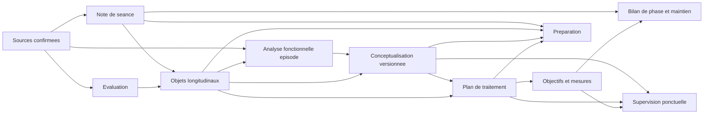

# Bibliotheque de documents cliniques V1

**Phase :** conception clinique et documentaire, sans implementation

**Date :** 21 aout 2026
**But :** definir une bibliotheque compacte de sorties TCC stables, lisibles et auditables pour Psycho IA

## 1. Decision directrice

Psycho IA doit produire **six types de documents cliniques centraux**, et non un document pour chaque objet de donnees :

1. evaluation clinique structuree ;
2. analyse fonctionnelle synchronique d'un episode ;
3. conceptualisation de cas TCC versionnee ;
4. plan de traitement collaboratif ;
5. note clinique structuree de seance ;
6. bilan de phase et plan de maintien.

Quatre produits utiles restent des **vues derivees** :

- preparation de prochaine seance ;
- tableau de suivi des objectifs et mesures ;
- revue critique ou supervision ;
- fiche d'options de protocoles ou strategies.

Les outils d'exposition, d'experience comportementale, d'activation comportementale, de resolution de probleme, de travail cognitif et, conditionnellement, de clarification des valeurs ACT sont des **modules specialises**. Ils n'existent que lorsqu'une indication et une decision clinique les rendent utiles.

Cette architecture conserve une sortie simple pour le psychologue. Les donnees, objets longitudinaux, sources et statuts restent dans le moteur ; les documents n'en sont que des representations cliniques stables.

## 2. Methode et statut des sources

### 2.1 Trois niveaux a ne pas confondre

Dans ce document :

- **SOURCE BIBLIOGRAPHIQUE** designe un principe ou une distinction attribuable a un ouvrage identifie ;
- **SYNTHESE** designe une conclusion obtenue en croisant plusieurs sources ;
- **CHOIX PSYCHO IA** designe une decision de structure, d'ergonomie ou d'architecture propre au projet.

Aucun auteur du corpus ne decrit l'architecture informatique de Psycho IA. Les decisions sur les sources de verite, la derivation des vues, les identifiants ou les niveaux internes d'inference sont donc toujours des choix du projet.

### 2.2 Corpus effectivement consulte pendant cette mission

Les huit analyses `00` a `07` ont ete relues. Quatre EPUB actuellement presents dans `Sources/` ont ete ouverts directement :

- Beck, *Cognitive Behavior Therapy: Basics and Beyond*, 3e edition, chapitres 2, 3, 5, 9, 10 et 21 ;
- Cottraux, *Les psychotherapies cognitives et comportementales*, 6e edition, chapitre 6, notamment la grille SECCA et les grilles alternatives ;
- Bouvet, *Manuel pratique de therapies comportementales, cognitives et emotionnelles*, chapitre 2 ;
- Bouvard et Cottraux, *Protocoles et echelles d'evaluation en psychiatrie et psychologie*, chapitres 1, 2 et 6.

L'inventaire `00_inventaire_sources.md` decrit huit autres ouvrages auparavant analyses : Antony et Barlow, Barlow, le Protocole unifie, Persons, Kuyken/Padesky/Dudley, Eells, Leahy et Luoma/Hayes/Walser. Leurs fichiers ne sont pas presents dans le dossier `Sources/` au moment de cette mission. Leurs apports sont donc repris a partir des analyses internes detaillees `00` a `05`, sans pretendre a une nouvelle verification directe de leurs pages.

## 3. Principes directeurs

### 3.1 Un document, une fonction clinique

Un document autonome est justifie seulement s'il :

- repond a une question clinique distincte ;
- possede une unite d'analyse et un rythme de mise a jour propres ;
- peut etre lu et utilise sans recreer une verite parallele ;
- apporte un gain de temps regulier ou une decision plus explicite.

Une liste, un score, un objectif ou une proposition de technique n'est pas automatiquement un document.

### 3.2 Une structure stable, un contenu variable

Chaque type de document possede un ordre de rubriques stable. Une rubrique peut etre conditionnelle ou omise lorsqu'elle est non pertinente. Une absence importante doit etre montree comme **donnee a explorer**, et non remplie par une phrase generique.

### 3.3 Separation epistemique interne

Les assertions utilisent cinq niveaux internes :

| Niveau | Sens | Rendu clinique prefere |
|---|---|---|
| A - documente directement | present dans une source clinique admissible | fait ou element documente |
| B - synthese du suivi | rapprochement prudent de plusieurs faits | synthese actuelle |
| C - hypothese clinique | explication testable, non etablie | hypothese a verifier |
| D - decision clinicien | objectif, priorite, accord ou choix valide | decision ou accord clinique |
| E - information manquante | lacune susceptible de modifier une decision | donnee a explorer |

Ces codes restent en arriere-plan. Le clinicien voit des intitulés comprehensibles, une provenance accessible et des limites explicites.

### 3.4 Orientation comportementale puis cognitive

**SOURCE BIBLIOGRAPHIQUE.** Persons, Cottraux, Bouvet et les chapitres comportementaux recenses dans Eells placent l'observation des antecedents, reponses et consequences au coeur de l'analyse fonctionnelle. Beck ajoute une conceptualisation cognitive evolutive reliant situations, cognitions, emotions, comportements, forces et objectifs.

**SYNTHESE.** Le noyau par defaut de Psycho IA est : episode concret, comportement ou reponse cible, consequences a court et long terme, fonction a verifier, objectif, essai et mesure. Les cognitions, croyances et strategies sont ajoutees lorsqu'elles expliquent les donnees ou modifient la decision.

**CHOIX PSYCHO IA.** L'ACT n'a pas de dossier parallele. Ses concepts n'apparaissent que comme hypotheses ou options dans les memes documents, apres activation clinique explicite ou question candidate validee.

### 3.5 Collaboration sans champ artificiel omnipresent

La demande, les objectifs exprimes, les preferences, l'accord, les desaccords, les ressources et les obstacles a l'engagement ont une place precise :

- evaluation : demande, attentes, preferences et ressources ;
- conceptualisation : comprehension partagee et degre d'accord ;
- plan : objectifs negocies, options, consentement et arbitrages ;
- seance : decisions conjointes, feedback et difficulte de collaboration documentee ;
- supervision : revue de la collaboration uniquement si les donnees la rendent pertinente.

Il n'existe pas de rubrique obligatoire « alliance therapeutique » dans chaque document.

### 3.6 Une seule autorite par objet

**CHOIX PSYCHO IA.** Les documents referencent les objets longitudinaux et les sources ; ils ne les dupliquent pas comme nouvelles autorites.

- problemes, objectifs, taches et elements a reprendre : registres longitudinaux ;
- valeurs de mesure : evenements sources et series de mesures ;
- episodes fonctionnels : registre d'episodes valides ;
- hypotheses macro : conceptualisation versionnee ;
- decisions de traitement : plan actif versionne ;
- preparation et supervision : vues sans droit de modification automatique.

## 4. Architecture compacte recommandee

| Produit | Statut | Unite | Moment principal | Frequence | Autorite clinique |
|---|---|---|---|---|---|
| Evaluation clinique structuree | document central | personne et contexte de soin | debut, changement majeur, reprise | initiale puis revision ciblee | sources d'evaluation et decisions validees |
| Analyse fonctionnelle synchronique | document central repetable | episode ou situation-probleme | quand une cible concrete doit etre comprise | selon besoin, plusieurs par probleme | episodes valides et sources associees |
| Conceptualisation de cas TCC | document central | personne et problemes relies | apres donnees suffisantes, puis revision | aux tournants cliniques | conceptualisation active versionnee |
| Plan de traitement | document central | trajectoire de traitement | apres objectifs et formulation suffisants | revision decisionnelle | plan actif versionne |
| Note clinique structuree de seance | document central | seance | apres chaque seance | chaque seance | source clinique confirmee et decisions de seance |
| Bilan de phase et maintien | document central | phase therapeutique | revue, espacement, fin ou reprise | a chaque fin de phase | objets valides et apprentissages documentes |
| Preparation de seance | vue derivee | prochaine seance | juste avant consultation | a la demande ou avant seance | aucune |
| Objectifs et mesures | vue derivee | objectif et serie temporelle | revue de progression | selon calendrier de mesure | registres et resultats de mesure |
| Supervision / revue critique | vue derivee | suivi jusqu'a une date de coupure | demande, revue periodique ciblee ou impasse validee | non systematique | aucune |
| Options de protocoles | vue derivee conditionnelle | probleme/mecanisme | choix ou revision de strategie | ponctuelle | aucune ; decision dans le plan |

### 4.1 Taille et profondeur cible

| Produit | Format ordinaire | Profondeur maximale utile |
|---|---|---|
| Evaluation clinique structuree | 2 a 4 pages | 6 pages si le contexte est complexe ; annexes pour les details |
| Analyse fonctionnelle synchronique | 1 page | 2 pages avec preuves, alternatives et test |
| Conceptualisation versionnee | 1 a 2 pages | 3 pages ; vues ou annexes pour les cartes complexes |
| Plan de traitement | 1 a 2 pages | 3 pages si plusieurs axes actifs |
| Note clinique de seance | une demi-page a 1 page | 2 pages si evenement clinique majeur |
| Bilan de phase et maintien | 1 a 2 pages | 3 pages avec plan de maintien detaille |
| Preparation | 1 page | pas d'extension : renvoyer aux documents sources |
| Supervision | 1 a 3 pages | 4 pages avec questions prioritaires et alternatives |

La complexite clinique justifie parfois davantage de detail, mais celui-ci doit etre place dans le document dont il sert la fonction. La longueur ne doit pas provenir de la repetition des donnees du dossier.

## 5. Documents centraux

### 5.1 Evaluation clinique structuree

**Objectif clinique.** Organiser l'etat des lieux descriptif, la demande, le contexte, les ressources, les traitements, les donnees diagnostiques et les inconnues qui conditionnent la suite.

**Unite et moment.** Personne dans un contexte de soin donne ; document initial, actualise par sections lorsqu'un changement majeur rend l'etat precedent trompeur.

**Ordre stable des rubriques.**

1. cadre, motif et demande ;
2. difficultes actuelles et retentissement ;
3. chronologie et evolution ;
4. contexte de vie cliniquement pertinent ;
5. sante, traitements, sommeil, activite et consommations lorsque pertinents ;
6. ressources, forces, soutiens et facteurs protecteurs ;
7. attentes, objectifs exprimes et preferences ;
8. donnees diagnostiques ;
9. mesures disponibles ;
10. vigilances documentees et inconnues decisionnelles ;
11. sources, date de coupure et limites.

**Obligatoire.** Cadre, motif/demande disponible, difficultes principales, retentissement disponible, sources et limites. L'absence d'une information importante est explicite ; les rubriques non pertinentes sont omises.

**Niveaux.** Les rubriques 1 a 7 reposent surtout sur A ; une chronologie reconstruite peut etre B. Un diagnostic etabli et une decision sont A ou D selon la source. Hypotheses et differentiels sont C. Les criteres non explores sont E.

**Ne jamais inventer.** Diagnostic, absence de risque, objectif partage, consommation, traitement, antecedent, ressource, causalite historique ou reponse negative a une question non posee.

**Relation.** L'evaluation alimente les problemes suivis et les questions a explorer. Elle ne remplace ni l'analyse d'un episode ni la conceptualisation explicative.

**Fondements.** Antony et Barlow pour l'evaluation orientee par une question ; Persons pour la liste et la priorisation des problemes ; Kuyken et al. pour le premier niveau descriptif ; Beck, chapitre 5, pour l'evaluation initiale et sa poursuite pendant le suivi. References detaillees : `01_cartographie_clinique.md`, section 4.

### 5.2 Analyse fonctionnelle synchronique d'un episode

**Objectif clinique.** Comprendre un episode precis et ce que les reponses produisent a court et a plus long terme, afin de rendre une hypothese fonctionnelle testable.

**Unite et moment.** Un episode ou une occurrence delimitee d'un probleme. Plusieurs analyses peuvent exister pour un meme probleme ; elles ne sont pas fusionnees automatiquement.

**Rubriques principales.** Reperes, contexte/antecedents, reponses, consequences immediates, consequences differees, hypothese de fonction, preuves et alternatives, variations/ressources, donnees a explorer, comprehension partagee.

**Niveaux.** Les composants de l'episode sont A ; la regularite entre occurrences est B ; la fonction et le mecanisme sont C ; le choix d'un test ou d'une intervention est D ; une consequence inconnue est E.

**Relation.** L'episode fournit des preuves a la conceptualisation et au plan. Il ne contient ni une formulation globale ni un protocole complet.

**Fondements.** Cottraux, chapitre 6 ; Bouvet, chapitre 2 ; Persons, chapitre 3 ; Kuyken et al., chapitre 6 ; Eells, chapitre 11. La specification complete figure dans `09_template_prioritaire_v1.md`.

### 5.3 Conceptualisation de cas TCC versionnee

**Objectif clinique.** Expliquer de facon provisoire les relations entre problemes, mecanismes actuels, facteurs contextuels utiles et ressources, puis guider ce qui doit etre teste ou revise.

**Unite et moment.** Personne et ensemble de problemes actifs ; premiere version lorsque plusieurs donnees convergent, puis nouvelle version a chaque changement de comprehension ou de direction.

**Ordre stable des rubriques.**

1. problemes expliques et priorites validees ;
2. description transversale des cycles actuels ;
3. mecanismes de maintien prioritaires ;
4. liens entre problemes ;
5. facteurs precipitants documentes ;
6. facteurs historiques ou predisposants utiles, conditionnels ;
7. ressources, protections, exceptions et forces ;
8. preuves pour et contre ;
9. hypotheses alternatives ;
10. predictions testables et donnees a obtenir ;
11. implications pour les objectifs et le plan ;
12. comprehension partagee, desaccords et limites ;
13. version, motif de revision et sources.

**Obligatoire.** Problemes expliques, au moins un cycle actuel et ses preuves, limites, version. Les causes distales ne sont jamais obligatoires.

**Niveaux.** Les problemes et episodes references restent A/B ; les liens explicatifs sont C ; les priorites et implications retenues sont D ; les lacunes testables sont E.

**Frontiere avec la formulation globale et les 5P.**

**SOURCE BIBLIOGRAPHIQUE.** Persons distingue formulation du cas, du probleme et du symptome ; Kuyken et al. distinguent niveaux descriptif, transversal et longitudinal ; Bouvet distingue conceptualisation macro et analyse micro. Les analyses precedentes ne montrent pas qu'un formulaire 5P unique soit necessaire au corpus TCC.

**SYNTHESE.** La « formulation globale » et la « conceptualisation de cas » remplissent la meme fonction macro pour Psycho IA. Elles doivent etre fusionnees. Les cinq familles `presenting`, `predisposing`, `precipitating`, `perpetuating`, `protective` peuvent servir de **vue conditionnelle** ou de controle de couverture, sans devenir cinq cases obligatoires ni remplacer les cycles fonctionnels actuels.

**CHOIX PSYCHO IA.** La conceptualisation commence descriptive et transversale. La diachronie et les predispositions ne sont ajoutees que si elles expliquent un mecanisme actuel, une non-reponse ou une decision.

#### Place exacte des 5P

Le modele 5P n'est pas retenu comme document autonome ni comme squelette obligatoire. Lorsqu'il est utile, il fournit une vue de controle de la conceptualisation active :

| Famille 5P | Representation Psycho IA | Statut dominant | Regle |
|---|---|---|---|
| `presenting` | problemes actuels, demande et retentissement | A/B, priorites D | vient de l'evaluation et des problemes suivis |
| `predisposing` | vulnerabilites ou apprentissages historiques pertinents | A pour l'evenement, C pour son role explicatif | omis si le lien au present ou au plan n'est pas utile |
| `precipitating` | changement ou evenement proche du debut/aggravation | A pour l'evenement, C pour son role precipitant | la proximite temporelle ne prouve pas la causalite |
| `perpetuating` | cycles et mecanismes actuels de maintien | C, soutenu par episodes A/B | coeur de la conceptualisation TCC ; doit rester testable |
| `protective` | ressources, exceptions, soutiens et conditions protectrices | A/B ; role protecteur parfois C | contextualise, jamais simple liste de qualites |

**SOURCE BIBLIOGRAPHIQUE.** Les sources directement consultees distinguent histoire, facteurs actuels, consequences et ressources, mais cette mission n'a pas retrouve dans les quatre EPUB une prescription transversale d'un formulaire 5P unique.

**SYNTHESE.** Les 5P aident a verifier qu'une conceptualisation ne se limite ni aux symptomes ni aux vulnerabilites. Ils ne montrent pas a eux seuls la sequence d'un episode, la fonction d'un comportement, les preuves contradictoires ou la prediction testable.

**CHOIX PSYCHO IA.** Les cinq familles sont donc des etiquettes de vue sur des informations deja autorisees. Elles ne creent pas de nouvelles assertions et une case peut rester vide.

### 5.4 Plan de traitement collaboratif

**Objectif clinique.** Montrer pourquoi une strategie est retenue pour cette personne, comment son effet sera observe et quand elle devra etre revisee.

**Unite et moment.** Trajectoire de traitement active ; creation apres objectifs valides et conceptualisation suffisamment utile, puis revision lors d'une decision substantielle.

**Ordre stable des rubriques.**

1. direction partagee et priorites ;
2. objectifs actifs references ;
3. pour chaque axe : probleme, cible/mecanisme, strategie, justification individualisee ;
4. intervention ou essai prevu ;
5. taches et conditions de mise en oeuvre ;
6. indicateurs et calendrier de mesure ;
7. prediction attendue ;
8. preferences, accord, obstacles et prerequis ;
9. vigilances pertinentes ;
10. criteres de poursuite, adaptation, arret ou solution de repli ;
11. sequence et dependances ;
12. version et date de revue.

**Obligatoire.** Au moins un objectif valide, une cible, une strategie, une justification, un indicateur et un critere de reevaluation. Un intitulé generique de technique sans rationale est invalide.

**Niveaux.** Problemes et resultats de mesure : A/B. Mecanisme : C. Objectifs, strategie choisie, sequence et accord : D. Prerequis inconnus : E.

**Fondements.** Persons, chapitre 7 ; Beck, chapitre 9 ; Bouvet, chapitre 3 ; Eells, chapitres 9 et 11. Voir `01_cartographie_clinique.md`, section 9.

### 5.5 Note clinique structuree de seance

**Objectif clinique.** Donner une version lisible et concise de ce qui s'est passe, de ce qui a ete decide et de ce qui doit rester disponible pour le suivi.

**Unite et moment.** Une seance ; generation apres confirmation de la source et revue clinique selon le niveau d'usage retenu.

**Ordre stable des rubriques.**

1. date et cadre ;
2. faits et changements pertinents ;
3. difficultes, emotions, cognitions et comportements contextualises ;
4. mesures ou observations du jour ;
5. sujets travailles ;
6. interventions effectivement realisees et reponse observee ;
7. decisions conjointes et objectifs concernes ;
8. taches convenues ;
9. elements explicitement reportes ;
10. incertitudes, limites et source.

**Obligatoire.** Date, faits utiles, intervention/reponse si elles existent, decisions/taches si elles existent, limites. Une rubrique vide n'est pas remplie par une formule passe-partout.

**Niveaux.** Ce document privilegie A et D. Une breve synthese B peut relier les elements de la seance. Les hypotheses C ne sont incluses que si elles ont effectivement ete formulees ou sont clairement separees comme pistes de travail.

**Relation.** La note alimente les objets longitudinaux ; elle n'est pas une conceptualisation ni une preparation.

**Fondements.** Beck, chapitres 10 et 11, et les principes de structure de seance croises dans `01_cartographie_clinique.md`, section 10. La forme exacte de la note est un choix Psycho IA.

### 5.6 Bilan de phase et plan de maintien

**Objectif clinique.** Evaluer une phase, rendre visibles les apprentissages, decider de la suite et, lorsque pertinent, organiser maintien, espacement ou fin.

**Unite et moment.** Phase therapeutique ; revue planifiee, changement de strategie, espacement, fin ou reprise.

**Ordre stable des rubriques.**

1. periode et objectifs de la phase ;
2. changements documentes ;
3. mesures et signification clinique prudente ;
4. interventions essayees et apprentissages ;
5. objectifs atteints, poursuivis, revises ou abandonnes par decision ;
6. difficultes et incertitudes restantes ;
7. ressources et competences acquises ;
8. decision de phase ;
9. si pertinent : signes precoces individualises, actions graduees, soutiens, modalites de reprise ;
10. sources, limites et prochaine revue.

**Niveaux.** Changements et essais : A/B. Explication d'une non-reponse : C. Decision de phase et plan de maintien : D. Donnees necessaires mais absentes : E.

**Fondements.** Beck, chapitre 21 ; Bouvet, chapitre 7 ; Protocole unifie, chapitre 14, tels que cartographies dans `01_cartographie_clinique.md`, sections 13 et 14.

## 6. Vues derivees

### 6.1 Preparation de prochaine seance

Le document `05_preparation_prochaine_seance.md` reste la specification de reference. Il n'est pas a reinventer.

La preparation lit, dans cet ordre :

1. fraicheur et limites des sources ;
2. dernieres donnees de seance ;
3. vigilances pertinentes ;
4. problemes et objectifs actifs ;
5. taches et resultats documentes ;
6. mesures dues ou a interpreter ;
7. elements a reprendre ;
8. conceptualisation et plan actifs ;
9. changements recents ;
10. questions et options strictement conditionnelles.

Elle reste courte : une page, lecture visee en deux a trois minutes. Elle ne cree, ne ferme et ne modifie aucun objet.

### 6.2 Tableau des objectifs et mesures

Ce produit n'est pas un nouveau dossier narratif. C'est une vue des objectifs actifs, de leurs indicateurs et des series comparables.

Pour chaque objectif : formulation validee, indicateur, ligne de base si disponible, derniers points, tendance prudente, date suivante et limite d'interpretation. Les valeurs brutes restent dans leur source canonique.

### 6.3 Supervision ou revue critique TCC

**Fonction.** Porter un regard structure sur la coherence du suivi, sans creer automatiquement une critique.

**Declenchement recommande.**

- a la demande du clinicien ;
- lors d'une revue de phase ;
- apres un signal non decisionnel valide : absence de progression attendue, aggravation, taches non revues de facon repetee, strategie repetee sans effet, rupture ou contradiction majeure.

Pas de generation a chaque seance. Un signal ouvre une proposition de revue ; le clinicien decide de la produire.

**Rubriques.** Direction et objectifs, adequation formulation-plan, essais et effets, mesures, taches et apprentissages, hypotheses testees/non testees, contradictions, collaboration documentee, risques de derive, questions prioritaires et options de reformulation.

Les formulations comme « evitement du therapeute » restent des hypotheses C soutenues par des observations precises, jamais des conclusions automatiques. La revue n'a aucune autorite sur le plan avant validation.

### 6.4 Fiche d'options de protocoles ou strategies

Une proposition comprend :

- approche ou protocole ;
- probleme, objectif ou mecanisme vise ;
- elements du cas compatibles ;
- donnees manquantes ou criteres a verifier ;
- prerequis, limites et points de vigilance ;
- source bibliographique ;
- statut `option a discuter`.

Le diagnostic seul ne declenche jamais une proposition. Une option n'entre dans le plan qu'apres decision clinique. Lorsqu'un protocole complet est retenu, sa fidelite et ses adaptations doivent etre distinguees d'un simple emprunt de module.

## 7. Modules conditionnels

| Module | Quand le generer | Noyau du template | Statut |
|---|---|---|---|
| Exposition | exposition choisie dans le plan | cible, prediction, comportements de securite, difficulte, conditions, essai, resultat, apprentissage, suite | prioritaire apres plan |
| Experience comportementale | croyance ou prediction testable | prediction, test, indicateur, resultat, conclusion, generalisation prudente | prioritaire |
| Activation comportementale | reduction d'activite ou evitement fonctionnel documente | activite, contexte, anticipation, plaisir/maitrise ou autre indicateur choisi, obstacle, realisation, effet | prioritaire |
| Resolution de probleme | probleme concret et modifiable retenu | definition, objectif, options, choix, plan, essai, resultat | utile |
| Travail cognitif | cognition cible reliee a un mecanisme/objectif | situation, cognition, emotion, donnees pour/contre, reponse alternative, essai | utile, non systematique |
| Valeurs ACT | ACT activee ou valeur ajoutée validee | domaine choisi, direction, obstacle fonctionnel, action engagee, retour d'experience | conditionnel |

### Modules non retenus en V1

- **Plan de securite/vigilance :** important, mais il exige un chantier de gouvernance, de responsabilite et de procedures distinct ; il ne doit pas etre improvise comme simple template TCC.
- **CBT-I generique :** ne pas creer avant une revue specifique des sources actuelles, des indications, differentiels, mesures et precautions.
- **Formulaire de protocole universel :** les protocoles ont des logiques et prerequis differents ; une fiche d'option commune suffit avant qu'un protocole soit effectivement choisi.

## 8. Documents fusionnes, transformes ou rejetes

| Candidat initial | Decision | Motif |
|---|---|---|
| Formulation globale et conceptualisation | fusion dans `conceptualisation de cas TCC versionnee` | meme fonction macro ; la diachronie/5P devient une extension conditionnelle |
| Objectifs therapeutiques | objets longitudinaux + vue dans plan/tableau | un objectif a un cycle de vie, mais ne justifie pas un document narratif autonome |
| Mesures et questionnaires | donnees/series + tableau derive | evite une copie de valeurs ; la strategie de mesure appartient au plan |
| Protocoles evidence-based | fiche d'options derivee + modules apres decision | une bibliotheque de connaissances n'est pas un document patient permanent |
| Preparation | vue derivee conservee | fonction operationnelle distincte, mais aucune source de verite |
| Supervision | vue derivee ponctuelle | forte valeur a certains moments, bruit et faux positifs si permanente |
| Prevention de rechute | section conditionnelle du bilan/maintien | evite un document separe avant qu'un plan de maintien soit pertinent |
| 5P | vue conditionnelle de conceptualisation | utile comme controle de couverture, mais non obligatoire et non suffisant pour les cycles actuels |
| Diagnostic | section de l'evaluation, puis reference conditionnelle | ne constitue ni conceptualisation ni plan |
| Tableau d'alliance | rejete comme document autonome | collaboration representee la ou elle influence evaluation, plan, seance ou revue |

## 9. Distinctions operationnelles

### 9.1 Evaluation

Question : **quelles donnees descriptives et decisionnelles avons-nous ?**

Unite : personne et contexte.

Produit principal : etat des lieux, pas explication causale.

### 9.2 Analyse fonctionnelle synchronique

Question : **que se passe-t-il dans cet episode, et que produisent les reponses ?**

Unite : episode.

Produit principal : chaine proche des donnees et fonction a tester.

### 9.3 Conceptualisation

Question : **quel modele de travail explique le mieux les problemes et leur maintien actuel ?**

Unite : cas et problemes relies.

Produit principal : hypotheses macro versionnees, alternatives et predictions.

### 9.4 Plan de traitement

Question : **qu'allons-nous faire, pourquoi, comment saurons-nous si cela aide, et quand reviser ?**

Unite : trajectoire de traitement.

Produit principal : decisions collaboratives reliees a la formulation et aux mesures.

## 10. Place du diagnostic

Le diagnostic apparait dans l'evaluation sous quatre statuts distincts :

1. `diagnostic_documente` : pose par une source identifiee, avec date et auteur/structure si disponibles ;
2. `hypothese_diagnostique` : hypothese clinique, avec elements compatibles et limites ;
3. `differentiel_a_examiner` : alternative motivee, non etiquette ajoutee ;
4. `donnees_manquantes` : informations necessaires pour avancer.

La conceptualisation peut referencer un diagnostic lorsqu'un modele de trouble eclaire une hypothese. Le plan peut referencer une recommandation ou un protocole, mais le diagnostic ne cree jamais automatiquement un mecanisme, un objectif ou une intervention.

## 11. Place des mesures

**SOURCE BIBLIOGRAPHIQUE.** Antony et Barlow organisent le choix d'une mesure par finalite. Bouvard et Cottraux distinguent mesures normatives et ipsatives et rappellent que la sensibilite intra-individuelle concerne les changements d'un meme sujet au cours de mesures repetees. Persons relie mesure des resultats et des processus a la revision du traitement.

**SYNTHESE.** Une strategie stable combine :

- un petit noyau institutionnel eventuel, a definir separement ;
- des mesures standardisees selectionnees pour une question precise ;
- des mesures idiographiques liees a un objectif, un mecanisme ou un comportement cible.

**CHOIX PSYCHO IA.** Chaque mesure doit porter : finalite, construit/comportement, instrument/version ou definition operationnelle, unite, conditions, frequence, regle de comparabilite, objet lie et date de revue. Un score isole n'est ni un diagnostic ni une decision. Les droits, versions et seuils des questionnaires exigent une verification specifique avant integration.

## 12. Relations entre documents

Les fleches representent des lectures ou des contributions validees. Aucune vue derivee ne modifie automatiquement un document central ou un registre.

## 13. Ordre de developpement recommande

| Rang | Produit | Valeur / faisabilite | Dependances minimales | Risque principal |
|---:|---|---|---|---|
| 1 | Analyse fonctionnelle synchronique V1 | coeur TCC, valeur visible, donnees actuelles partiellement disponibles | source confirmee, JSON V2, selection d'un episode, provenance | fonction inventee ou episodes melanges |
| 2 | Note clinique structuree de seance | usage frequent, sortie lisible immediate | pipeline actuel et decisions de seance | resume generique ou duplication |
| 3 | Evaluation clinique structuree | organise le debut du suivi et les inconnues | plusieurs sources, distinction temporelle | cases vides interpretees comme negatives |
| 4 | Conceptualisation versionnee | forte valeur de direction | problemes valides + episodes fonctionnels | reification d'hypotheses |
| 5 | Plan de traitement | relie formulation a action et mesure | objectifs valides + conceptualisation | catalogue de techniques generique |
| 6 | Tableau objectifs/mesures | pilotage empirique | strategie de mesure et series comparables | surinterpretation des scores |
| 7 | Modules exposition, experience, activation | gain protocolaire concret | intervention retenue dans le plan | utilisation hors indication/prerequis |
| 8 | Bilan de phase et maintien | consolide apprentissages et decisions | historique d'essais et mesures | conclure a tort a une resolution |
| 9 | Supervision / revue critique | utile pour impasses et qualite | trajectoire suffisamment documentee | critiques artificielles |
| 10 | Options de protocoles et extensions ACT | aide au choix complexe | bibliotheque a jour et filtres | prescription automatique |

La preparation de prochaine seance existe deja ; elle doit etre enrichie progressivement en lecture des nouveaux documents, sans etre reimplementee avant eux.

## 14. Premier template retenu

Le premier document a implementer est **l'analyse fonctionnelle synchronique d'un episode**.

### Justification

- **Valeur clinique :** elle transforme une note en outil de comprehension directement exploitable, au coeur de l'orientation comportementale retenue.
- **Frequence :** elle peut etre utilisee des qu'une situation-probleme concrete devient decisionnelle, sans attendre une conceptualisation complete.
- **Donnees actuelles :** le JSON V2 contient deja faits, contextes, emotions, cognitions, comportements et evitements. La transcription confirmee permet de revenir a la sequence exacte.
- **Demonstrateur :** elle teste toute la chaine `source confirmee -> extraction -> regroupement d'episode -> separation fait/hypothese -> document stable -> validation clinique`.
- **Dependances limitees :** il faut selectionner un episode et conserver une provenance par composant ; aucune nouvelle base, RAG ou refonte du pipeline n'est necessaire pour une V1.
- **Risque maitrisable :** une analyse partielle est autorisee ; la fonction, les consequences ou les sensations absentes restent inconnues.
- **Fondement :** convergence de Cottraux, Bouvet, Persons, Kuyken et Eells sur l'analyse d'occurrences concretes, tout en preservant les differences entre SECCA, ABC/SORC et cartes plus complexes.

La specification complete est dans `09_template_prioritaire_v1.md`.

## 15. Arbitrages restant ouverts

1. Le clinicien choisit-il toujours l'episode, ou valide-t-il un candidat propose par le systeme ? Recommandation V1 : candidat propose, confirmation avant consolidation.
2. Quel seuil rend une fonction suffisamment etayee pour etre affichee ? Recommandation V1 : aucune exigence de fonction ; si elle est affichee, preuves, alternative et test sont obligatoires.
3. Faut-il conserver une vue SECCA et une vue ABC ? Recommandation : un seul contenu canonique, avec rendus conditionnels sans duplication.
4. Quel niveau de validation autorise l'analyse a alimenter la conceptualisation ? Recommandation : seulement une analyse revue ou validee par le clinicien.
5. Quels questionnaires standardises et droits d'usage retenir ? Chantier distinct avant toute integration d'instrument.
6. Quelles procedures de vigilance et de securite ? Chantier de gouvernance distinct ; ne pas le deduire du corpus TCC seul.

## 16. Recommandation pour la prochaine mission

La prochaine mission peut implementer **uniquement** l'analyse fonctionnelle synchronique V1, sur patients fictifs :

1. definir le contrat de donnees du document selon `09_template_prioritaire_v1.md` ;
2. construire des fixtures couvrant episode complet, episode partiel, deux episodes a ne pas fusionner, contradiction, OCR incertain et absence de consequence ;
3. implementer d'abord les controles deterministes et le rendu stable ;
4. seulement ensuite tester la generation sur les sources fictives confirmees ;
5. ne brancher ni conceptualisation ni plan de traitement dans la meme mission.

## 17. References principales

- Antony, M. M., et Barlow, D. H. (dir.), *Handbook of Assessment and Treatment Planning for Psychological Disorders*, 3e ed., chapitres 1, 2 et 5. Localisation documentee dans `00_inventaire_sources.md` et `01_cartographie_clinique.md`.
- Beck, J. S., *Cognitive Behavior Therapy: Basics and Beyond*, 3e ed., chapitres 2, 3, 5, 9, 10 et 21. EPUB consulte directement.
- Bouvard, M., et Cottraux, J., *Protocoles et echelles d'evaluation en psychiatrie et psychologie*, 5e ed., chapitres 1, 2 et 6, pp. 55-61. EPUB consulte directement.
- Bouvet, C., *Manuel pratique de therapies comportementales, cognitives et emotionnelles*, chapitre 2, pp. 31-52, et chapitre 3. EPUB consulte directement.
- Cottraux, J., *Les psychotherapies cognitives et comportementales*, 6e ed., chapitre 6, pp. 98-106. EPUB consulte directement.
- Eells, T. D. (dir.), *Handbook of Psychotherapy Case Formulation*, 3e ed., chapitres 1, 9 et 11. Localisation documentee dans les analyses `00` et `01`.
- Kuyken, W., Padesky, C. A., et Dudley, R., *Collaborative Case Conceptualization*, chapitres 2, 5, 6, 7 et 9. Localisation documentee dans les analyses `00` et `01`.
- Persons, J. B., *The Case Formulation Approach to Cognitive-Behavior Therapy*, chapitres 1, 3, 5, 6, 7, 9 et 10. Localisation documentee dans les analyses `00` et `01`.
- Barlow, D. H., et al., *Unified Protocol for Transdiagnostic Treatment of Emotional Disorders: Therapist Guide*, 2e ed., chapitres 4-14. Localisation documentee dans les analyses `00` et `01`.
